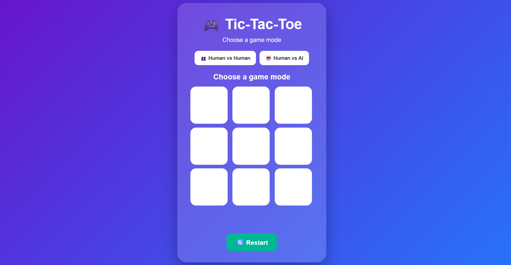

# 🎮 Tic-Tac-Toe Web Application

A colorful and interactive **Tic-Tac-Toe Web Application** built using **HTML, CSS, and JavaScript**.

The game supports both **Human vs Human** and **Human vs AI** gameplay. Players can click on the game board to place their marks, while the application automatically tracks turns, checks winning combinations, and detects draws.

## 🚀 Live Project

👉 **[Play Tic-Tac-Toe](https://YOUR-GITHUB-USERNAME.github.io/YOUR-REPOSITORY-NAME/)**

> Replace the link above with your actual GitHub Pages URL after deploying the project.

## 📸 Screenshot

GitHub supports displaying repository images using relative paths, so keeping the screenshot inside your repository is recommended.

## ✨ Features

* 🎮 Human vs Human mode
* 🤖 Human vs AI mode
* ❌ X and ⭕ O player markers
* 🏆 Automatic winner detection
* 🤝 Draw detection
* 🧠 AI attempts to win and block the player's winning move
* 🔄 Restart game functionality
* 🎨 Colorful and responsive interface
* 🖱️ Interactive game board
* 🚫 Prevents selecting an already occupied cell

## 🛠️ Technologies Used

* **HTML5** — Structure of the game
* **CSS3** — Styling, colors, layout, and animations
* **JavaScript** — Game logic, player turns, AI moves, and winner detection

## 🎯 How to Play

### 👥 Human vs Human

1. Click **Human vs Human**.
2. Player X starts the game.
3. Click any empty box.
4. Player O gets the next turn.
5. Continue taking turns.
6. The first player to get three marks in a row wins.

### 🤖 Human vs AI

1. Click **Human vs AI**.
2. You play as **X**.
3. Click an empty box.
4. The AI plays as **O**.
5. The AI attempts to make a winning move or block your winning move.
6. Get three X marks in a row to win.

## 🏆 Winning Conditions

A player wins when they get three identical marks in:

## 💡 What I Learned

While developing this project, I improved my understanding of:

* DOM manipulation
* JavaScript event handling
* Arrays
* Conditional statements
* Functions
* Game-state management
* Winning-condition logic
* Basic AI decision-making
* Interactive frontend development

## 🔮 Future Improvements

Some possible future enhancements include:

* 🏅 Score tracking
* 🔊 Sound effects
* 🌙 Dark mode
* 📱 Improved mobile responsiveness
* 🧠 More advanced AI difficulty levels
* 🎨 Additional themes and animations

## 👩‍💻 Author

**Devi Sushma**

B.Tech — Computer Science and Engineering

## 🙏 Acknowledgement

Special thanks to **Prodigy Infotech** for providing the learning opportunity and encouraging me to develop practical web development projects.

---

⭐ If you like this project, feel free to explore the repository and try the game!
